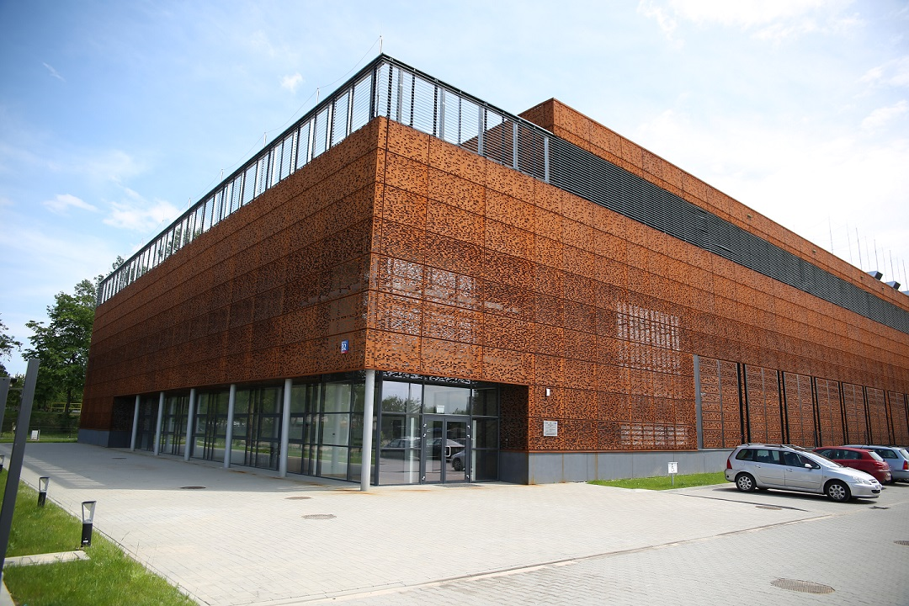

# Start

Witamy na stronie domowej warsztatów z narzędzi grafowych i sieciowych prowadzonych w [Interdyscyplinarnym Centrum Modelowania Matematycznego i Komputerowego Uniwersytetu Warszawskiego](http://icm.edu.pl/).

Obecnie prowadzone są następujące warsztaty:

- [Urika-XC Cray Graph Engine](https://pubs.cray.com/bundle/Cray_Graph_Engine_User_Guide_32UP02_S-3015/page/About_the_Cray_Graph_Engine_CGE.html) dostępnego na superkomputerze [Okeanos](https://kdm.icm.edu.pl/O_zasobach_ICM/Zasoby/komputery_w_icm/#superkomputer-okeanos);
- [Trovares xGT](https://docs.trovares.com/) dostępnego na superkomputerze [Rysy](https://kdm.icm.edu.pl/O_zasobach_ICM/Zasoby/komputery_w_icm/#superkomputer-rysy).

Warsztaty te są rozdzielone, więc nie ma konieczności brania udziału w obu tych wydarzeniach.

**Ważne informacje**

!!! warning "Odblokowanie portu SSH (22)"
    Wszystkich uczestników prosimy o upewnienie się, że mają **odblokowany port SSH** (22).

    Więcej informacji na ten temat znajduje się na stronie *wymagań wstępnych* ([link](./wymagania)).

!!! warning "Formalności przed warsztatami 29-30.03.2021"
    Przed warsztatami uczestnicy zobowiązani są do:

    - przeczytania [Regulaminu użytkownika KDM](https://kdm.icm.edu.pl/O_zasobach_ICM/Formalnosci/regulamin/)
    - podpisania własnoręcznie lub elektronicznie Profilem Zaufanym [formularza użytkownika KDM](assets/formularz-uzytkownika.pdf) i wysłania go zeskanowanego/podpisanego elektronicznie na adres jj358817@icm.edu.pl z tytułem: "*Imię Nazwisko* - formularz użytkownika".

    Więcej informacji na ten temat znajduje się na stronie *wymagań wstępnych* ([link](./wymagania)).

!!! info "Materiały na warsztaty 29-30.03.2021"
    Prezentacje i materiały do warsztatów 29.03 - 30.03 **mogą ulegać zmianom** do poniedziałku 29.03.

!!! info "Link do warsztatów"
    Warsztaty marcowe odbędą się na platformie ClickMeeting: [Wirtualna Akademia ICM](https://supercomputingfrontiers.clickmeeting.com/wirtualna-akademia-icm-urika-xc-cray-graph-engine-i-trovares-xgt). Hasła do pokoju zostaną rozesłane drogą mailową.

Centrum Technologii ICM UW, ul. Kupiecka 32, Warszawa
