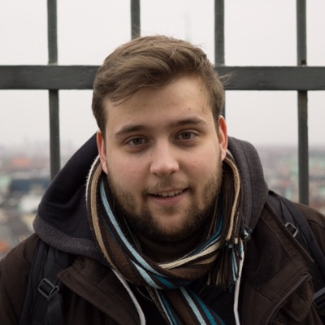
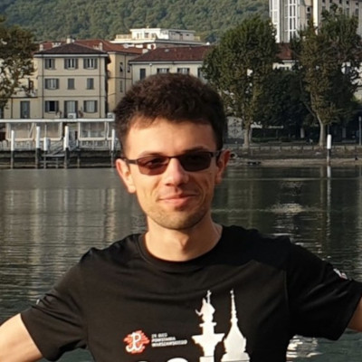

# Organizatorzy warsztatów

## Kontakt

Zapraszamy do kontaktu mailowego z zespołem organizacyjnym:

- Kuba Jałowiec: `jj358817@icm.edu.pl`
- Wojtek Chlapek: `wc425947@icm.edu.pl`

## O nas

| |  |
| --- | --- |
| 

 | 

 |
| **Kuba Jałowiec**   Ukończyłem studia inżynierskie na kierunku Informatyka na Wydziale Elektroniki i Technik Informacyjnych Politechniki Warszawskiej. Obecnie jestem studentem studiów magisterskich w ICM na kierunku Inżynieria Obliczeniowa. Piszę pracę magisterską z testowania wydajności obliczeń grafowych w big data. Poza programowaniem w języku Python lubię jeździć na rowerze i słuchać audiobooków. | **Wojtek Chlapek**   Ukończyłem studia z informatyki (magisterskie oraz inżynierskie) na Wydziale Elektroniki i Technik Informacyjnych PW. Obecnie studiuję Inżynierię Obliczeniową w ICM. Lubię niskopoziomowe języki programowania, algorytmikę i zagadnienia przetwarzania współbieżnego. Interesuję się także muzyką &ndash; ukończyłem szkołę muzyczną, śpiewam w chórze oraz w zespole gospelowym. Bardzo lubię też uprawiać różne sporty, zwłaszcza grać w siatkówkę.
