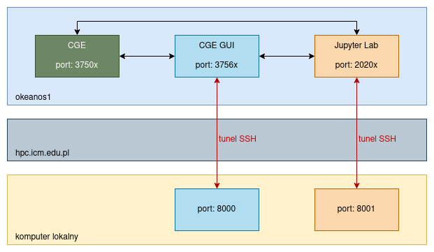

# Warsztaty Cray Graph Engine

## Logowanie na węźle dostępowym komputera Okeanos

Zaloguj się na komputerze `hpc.icm.edu.pl`:

```
ssh kdmszk0x@hpc.icm.edu.pl
```

**Uwaga**: w powyższej komendzie znak `x` podmień na ostatnią cyfrę loginu swojego konta szkoleniowego.

Następnie wpisz lub wklej hasło (wprowadzone znaki nie będą widoczne) i wciśnij klawisz Enter.

Zaloguj się na węźle dostępowym nr 1 komputera Okeanos:

```
ssh okeanos1
```

**Uwaga**: przy pierwszej próbie połączenia z Okeanosem może (choć nie musi) pojawić się ostrzeżenie: `The authenticity
of host 'okeanos1 [...]' can't be established. [...] Are you sure you want to continue connecting (yes/no)?` W takim
wypadku wpisujemy `yes` i wciskamy klawisz `Enter`.

### Sprawdzenie wersji Cray Graph Engine

Krok ten jest opcjonalny. Pomaga on upewnić się, że jesteśmy zalogowani na Okeanosie i Cray Graph Engine jest dostępny
(powinien być dostępny na każdym węźle obliczeniowym tego komputera).

Sprawdzenie wykonujemy komendą:

```
cge-launch --version
```

Na ekranie powinno zostać wypisane:

```
cge-launch version: 3.2.1465
```

## Przygotowanie środowiska

**Uwaga**: poniższe czynności należy wykonać tylko raz w trakcie trwania warsztatów, przy pierwszym logowaniu na
Okeanos.

Pobierz plik `Makefile` inicjalizujący środowisko:

```
cd ~ && wget https://git.icm.edu.pl/wc425947/cge-warsztaty/-/raw/master/Makefile
```

Uruchom go za pomocą komendy `make`:

```
make
```

Ustawianie środowiska może potrwać kilka minut. Sygnałem świadczącym o końcu tego procesu jest pojawienie się kolorowego
napisu `kdmszk0x@okeanos-login1 ~ $`.

## Ustawienie tuneli



Tunel można ustawić poprzez wpisanie w konsoli (na lokalnym komputerze) odpowiedniej komendy SSH i ten właśnie sposób
pokazano poniżej. Alternatywą może być np. odpowiednie ustawienie tuneli w programie PuTTY.

Komendę tę wykonujemy w terminalu, w którym **nie jesteśmy zalogowani przez SSH na serwerach ICM**.

**Uwaga**: tunel należy uruchomić w oddzielnym terminalu i nie zamykać go po wykonaniu komendy. Zamknięcie terminala
poskutkuje zamknięciem tunelu.

```
ssh -NT -L 8000:okeanos1:3756x -L 8001:okeanos1:2020x kdmszk0x@hpc.icm.edu.pl
```

**Uwaga**: w powyższej komendzie znak `x` podmień na ostatnią cyfrę loginu swojego konta szkoleniowego.

Po wpisaniu hasła nic nie wyświetli się w konsoli - jest to oczekiwane zachowanie.

## Przygotowanie zbioru danych

Konwersja Semantic Bible:

```
./apps/jena/bin/riot --out=NTRIPLES semantic_bible/NTNames.owl > dataset.nt
./apps/jena/bin/riot --out=NTRIPLES semantic_bible/NTN-individuals.owl >> dataset.nt
```

Przeniesienie zbioru danych do docelowego katalogu:

```
mv dataset.nt cge/db/
```

## Uruchomienie serwerów

Poniższe instrukcje pokazują, jak uruchomić serwery Cray Graph Engine, Cray Graph Engine GUI oraz Jupyter Lab.  Każdy z
tych serwerów należy uruchomić i pozostawić włączony w oddzielnej konsoli (da się to zrobić inaczej, jednak nie będzie
to omawiane).

### Uruchomienie Jupyter Lab

Jupyter Lab nie jest dostępny domyślnie na Okeanosie, można go uruchomić po uprzedniej aktywacji specjalnie
przygotowanego środowiska Pythona:

```
source virtualenv/bin/activate
```

Następnie można uruchomić serwer Jupyter Lab:

```
jupyter-lab --ip=0.0.0.0 --no-browser --port=2020x
```

**Uwaga**: w powyższej komendzie znak `x` podmień na ostatnią cyfrę loginu swojego konta szkoleniowego.

Następnie należy skopiować z konsoli token dostępu, a więc znaki rozpoczynające się po `?token=` . Następnie w
przeglądarce na lokalnym komputerze należy wejść na adres:

```
localhost:8001/?token=XXXX
```

podmieniając `XXXX` na skopiowany token.

Jako, że JupyterLab pozwala na otwieranie nowych okien konsoli, od tej pory możemy skorzystać z tej możliwości zamiast
otwierać kolejne okna konsoli wbudowanej w nasz system operacyjny.

### Uruchomienie CGE

```
cge-launch -d cge/db/ -o cge/output/ -l cge/logfile -p 3750x --runOpts=--reservation=urika
```

**Uwaga**: w powyższej komendzie znak `x` podmień na ostatnią cyfrę loginu swojego konta szkoleniowego.

### Uruchomienie CGE SPARQL GUI

```
cge-cli fe --db-port=3750x --server-port=3756x
```

**Uwaga**: w powyższej komendzie znak `x` podmień na ostatnią cyfrę loginu swojego konta szkoleniowego.

Następnie na lokalnym komputerze należy wejść w przeglądarce na adres:

```
localhost:8000
```

Aby sprawdzić, czy CGE GUI łączy się poprawnie z CGE, wystarczy wpisać zapytanie w polu *SPARQL Query*:

```
select * where { ?s ?p ?o } limit 10
```

Następnie należy zaznaczyć ptaszek *Force text/plain as the response Content-Type (forces results to be displayed in
browser)*, wybrać jako *Output Format* `TSV` i wcisnąć przycisk *Run Query*.

W tym momencie należy przejść do konsoli, w której jest uruchomiony serwer CGE GUI, i wpisać:

```
yes
```

jako potwierdzenie akceptacji klucza SSH. Pytanie takie jest zadawane tylko przy pierwszej próbie połączenia z CGE, nie
trzeba tego więcej razy robić w trakcie warsztatów.
